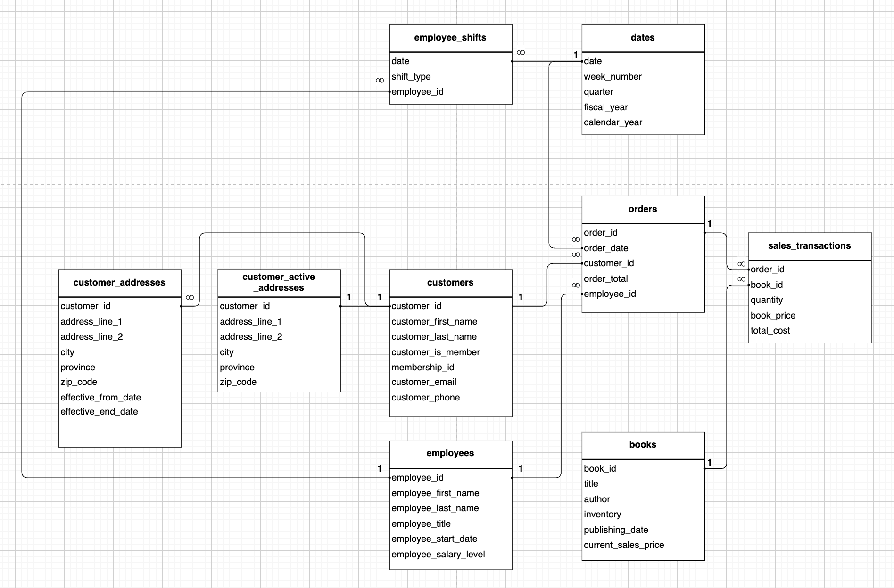

# Assignment 1: Design a Logical Model

## Question 1
Create a logical model for a small bookstore. 📚

At the minimum it should have employee, order, sales, customer, and book entities (tables). Determine sensible column and table design based on what you know about these concepts. Keep it simple, but work out sensible relationships to keep tables reasonably sized. Include a date table. There are several tools online you can use, I'd recommend [_Draw.io_](https://www.drawio.com/) or [_LucidChart_](https://www.lucidchart.com/pages/).


## Question 2
We want to create employee shifts, splitting up the day into morning and evening. Add this to the ERD.


## Question 3
The store wants to keep customer addresses. Propose two architectures for the CUSTOMER_ADDRESS table, one that will retain changes, and another that will overwrite. Which is type 1, which is type 2?

Type 1 overwrites, Type 2 keeps the historical data in a new row.


_Hint, search type 1 vs type 2 slowly changing dimensions._

Bonus: Are there privacy implications to this, why or why not?
```
While Type 2 retains historical data for better functionality, at the end its more personal data that can be accessed, so there is definetely a privacy implication to having a Type 2 table. In order to overcome 2 tables might be created at the same time one Type 1 only having the most current address while another one as Type 2 keeping the historical data. Access to Type 2 might be further limited through various access control means to overcome added privacy concerns. I've created another diagram to reflect this including both Type 1 and Type 2 tables.
```



## Question 4
Review the AdventureWorks Schema [here](https://i.stack.imgur.com/LMu4W.gif)

Highlight at least two differences between it and your ERD. Would you change anything in yours?
```
 1 - In AdventureWorks Schema Personal data is kept in different tables, making it easier for anonymization. In my model I've put email and phone number to the same table with other data. In second thoughts separating looks as the best practice for overcoming privacy concerns.
 2 - Prices can change overtime, in the AdventureWorks Schema they have a seperate prive history table, in my model I've put a book_price to the sales_transactions table and current_sales_price to books to overcome the price changes but having a separate price_history table should make things easier.
```

# Criteria

[Assignment Rubric](./assignment_rubric.md)

# Submission Information

🚨 **Please review our [Assignment Submission Guide](https://github.com/UofT-DSI/onboarding/blob/main/onboarding_documents/submissions.md)** 🚨 for detailed instructions on how to format, branch, and submit your work. Following these guidelines is crucial for your submissions to be evaluated correctly.

### Submission Parameters:
* Submission Due Date: `June 1, 2024`
* The branch name for your repo should be: `model-design`
* What to submit for this assignment:
    * This markdown (design_a_logical_model.md) should be populated.
    * Two Entity-Relationship Diagrams (preferably in a pdf, jpeg, png format).
* What the pull request link should look like for this assignment: `https://github.com/<your_github_username>/sql/pull/<pr_id>`
    * Open a private window in your browser. Copy and paste the link to your pull request into the address bar. Make sure you can see your pull request properly. This helps the technical facilitator and learning support staff review your submission easily.

Checklist:
- [X] Create a branch called `model-design`.
- [X] Ensure that the repository is public.
- [X] Review [the PR description guidelines](https://github.com/UofT-DSI/onboarding/blob/main/onboarding_documents/submissions.md#guidelines-for-pull-request-descriptions) and adhere to them.
- [X] Verify that the link is accessible in a private browser window.

If you encounter any difficulties or have questions, please don't hesitate to reach out to our team via our Slack at `#cohort-3-help`. Our Technical Facilitators and Learning Support staff are here to help you navigate any challenges.